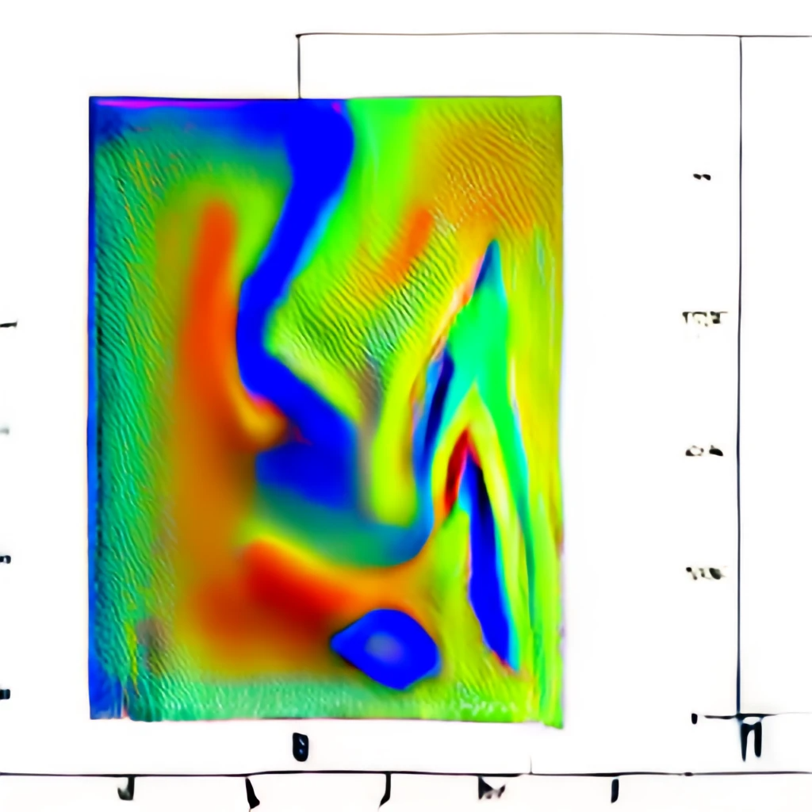

 

  
  <h1 align="center">Lumerical API toolbox
</h1>

    

Toolbox for simple control of Lumerical software.
  
  This toolbox isn't finished. I'll add new function with a time.
  

## Usage
1. Instal [Lumerical](https://www.lumerical.com/downloads/)
2. instal this [toolbox](https://github.com/alekseikukin/lumapi)
3. Setup [MATLAB to Lumerical API integration](https://optics.ansys.com/hc/en-us/articles/360026142074)
4. See the [example](example.m) .

## List of functions
See the [list of functions](list_of_functions.md) .

## License
Distributed under the MIT License. See [`LICENSE`](LICENSE) for more information.

## Contact
Project Link: [alekseikukin/lumapi](https://github.com/alekseikukin/lumapi) .

